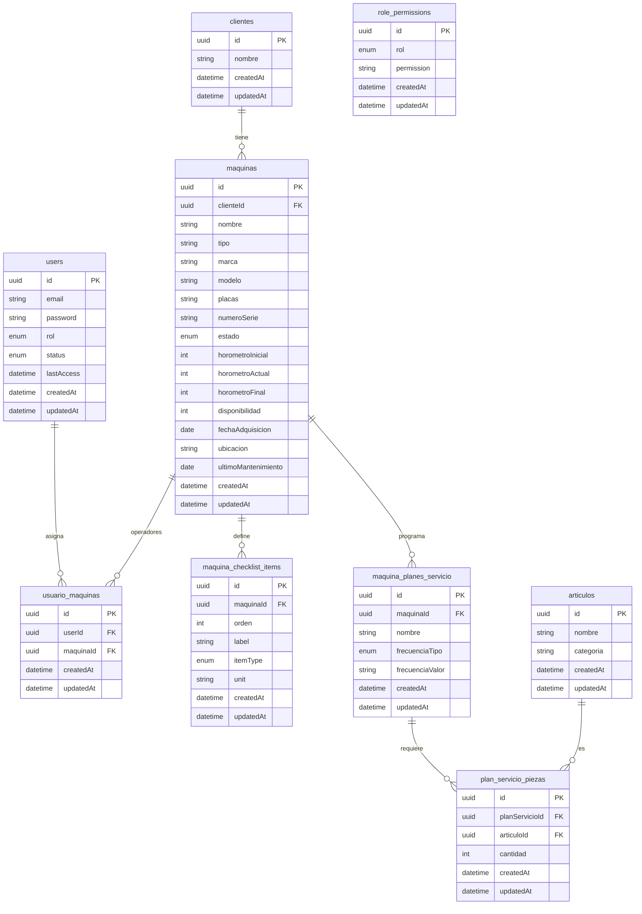

# Base de datos actual y API (ER + DBML)

Este documento describe el estado actual del backend: modelo entidad-relación, definición DBML para [dbdiagram.io](https://dbdiagram.io), propósito de cada tabla y endpoints existentes por tabla.

## Diagrama entidad-relación (Mermaid)



## Definición DBML (dbdiagram.io)

```dbml
Enum user_rol {
  admin
  usuario
  maquinista
}

Enum user_status {
  activo
  suspendido
}

Enum maquina_estado {
  Operativa
  Disponible
  Mantenimiento
  "Fuera de Servicio"
}

Enum checklist_item_type {
  check
  number
}

Enum frecuencia_tipo {
  km
  hrs
  meses
}

Table users {
  id uuid [pk]
  email varchar [not null, unique]
  password varchar [not null]
  rol user_rol [not null, default: 'usuario']
  status user_status [not null, default: 'activo']
  lastAccess datetime
  createdAt datetime [not null]
  updatedAt datetime [not null]
}

Table role_permissions {
  id uuid [pk]
  rol user_rol [not null]
  permission varchar(80) [not null]
  createdAt datetime [not null]
  updatedAt datetime [not null]

  indexes {
    (rol, permission) [unique, name: 'role_permissions_rol_permission_unique']
  }
}

Table clientes {
  id uuid [pk]
  nombre varchar [not null]
  createdAt datetime [not null]
  updatedAt datetime [not null]
}

Table articulos {
  id uuid [pk]
  nombre varchar [not null]
  categoria varchar [not null]
  createdAt datetime [not null]
  updatedAt datetime [not null]
}

Table maquinas {
  id uuid [pk]
  clienteId uuid [not null]
  nombre varchar [not null]
  tipo varchar [not null]
  marca varchar [not null]
  modelo varchar [not null]
  placas varchar [not null]
  numeroSerie varchar [not null]
  estado maquina_estado [not null, default: 'Operativa']
  horometroInicial int [not null, default: 0]
  horometroActual int [not null, default: 0]
  horometroFinal int [not null, default: 0]
  disponibilidad int [not null, default: 0]
  fechaAdquisicion date [not null]
  ubicacion varchar [not null]
  ultimoMantenimiento date
  createdAt datetime [not null]
  updatedAt datetime [not null]
}

Table maquina_checklist_items {
  id uuid [pk]
  maquinaId uuid [not null]
  orden int [not null, default: 0]
  label varchar [not null]
  itemType checklist_item_type [not null, default: 'check']
  unit varchar
  createdAt datetime [not null]
  updatedAt datetime [not null]
}

Table maquina_planes_servicio {
  id uuid [pk]
  maquinaId uuid [not null]
  nombre varchar [not null]
  frecuenciaTipo frecuencia_tipo [not null]
  frecuenciaValor varchar [not null]
  createdAt datetime [not null]
  updatedAt datetime [not null]
}

Table plan_servicio_piezas {
  id uuid [pk]
  planServicioId uuid [not null]
  articuloId uuid [not null]
  cantidad int [not null, default: 1]
  createdAt datetime [not null]
  updatedAt datetime [not null]

  indexes {
    (planServicioId, articuloId) [unique, name: 'plan_servicio_piezas_plan_articulo_unique']
  }
}

Table usuario_maquinas {
  id uuid [pk]
  userId uuid [not null]
  maquinaId uuid [not null]
  createdAt datetime [not null]
  updatedAt datetime [not null]

  indexes {
    (userId, maquinaId) [unique, name: 'usuario_maquinas_user_maquina_unique']
  }
}

Ref: maquinas.clienteId > clientes.id [delete: restrict, update: cascade]
Ref: maquina_checklist_items.maquinaId > maquinas.id [delete: cascade, update: cascade]
Ref: maquina_planes_servicio.maquinaId > maquinas.id [delete: cascade, update: cascade]
Ref: plan_servicio_piezas.planServicioId > maquina_planes_servicio.id [delete: cascade, update: cascade]
Ref: plan_servicio_piezas.articuloId > articulos.id [delete: restrict, update: cascade]
Ref: usuario_maquinas.userId > users.id [delete: cascade, update: cascade]
Ref: usuario_maquinas.maquinaId > maquinas.id [delete: cascade, update: cascade]
```

## Tablas existentes: propósito, funcionamiento y endpoints

### `users`
- **Propósito**: usuarios autenticables del sistema.
- **Funcionamiento**:
  - Guarda credenciales (`email`, `password`), rol (`admin`, `usuario`, `maquinista`) y estado.
  - `password` se hashea en hooks del modelo.
  - `lastAccess` se actualiza al login.
- **Endpoints relacionados**:
  - `POST /api/auth/login` (público, autenticación)
  - `POST /api/auth/permanent-token` (requiere permiso `users.manage`)
  - `GET /api/users`
  - `GET /api/users/:id`
  - `POST /api/users`
  - `PATCH /api/users/:id`
  - `DELETE /api/users/:id`

### `role_permissions`
- **Propósito**: matriz rol → permisos (RBAC basado en permisos).
- **Funcionamiento**:
  - Se carga en cada request autenticado mediante `loadRolePermissions`.
  - Los middlewares `requirePermission` / `requireAnyPermission` validan acceso contra estas filas.
  - Tiene índice único `(rol, permission)` para evitar duplicados.
- **Endpoints relacionados**:
  - No tiene CRUD público actualmente.
  - Se usa indirectamente por **todas** las rutas protegidas.

### `clientes`
- **Propósito**: catálogo de clientes dueños de máquinas.
- **Funcionamiento**:
  - Cada máquina pertenece a un cliente (`maquinas.clienteId`).
  - No se permite borrar cliente con máquinas (`ON DELETE RESTRICT`).
- **Endpoints relacionados**:
  - `GET /api/clientes`
  - `GET /api/clientes/:id`
  - `POST /api/clientes`
  - `PATCH /api/clientes/:id`
  - `DELETE /api/clientes/:id`

### `articulos`
- **Propósito**: inventario de artículos/piezas usadas en planes de servicio.
- **Funcionamiento**:
  - Se referencia desde `plan_servicio_piezas`.
  - El endpoint de listado soporta búsqueda por `q`.
- **Endpoints relacionados**:
  - `GET /api/articulos`
  - `GET /api/articulos/:id`
  - `POST /api/articulos`
  - `PATCH /api/articulos/:id`
  - `DELETE /api/articulos/:id`

### `maquinas`
- **Propósito**: entidad principal del módulo (inventario operativo de máquinas).
- **Funcionamiento**:
  - Guarda datos técnicos/operativos: estado, horómetros, disponibilidad, ubicación.
  - Se relaciona con checklist diario y planes de servicio.
  - Para `maquinista`, el acceso queda filtrado por asignaciones en `usuario_maquinas`.
- **Endpoints relacionados**:
  - `GET /api/maquinas`
  - `GET /api/maquinas/:id`
  - `POST /api/maquinas`
  - `PATCH /api/maquinas/:id`
  - `DELETE /api/maquinas/:id`

### `maquina_checklist_items`
- **Propósito**: ítems de inspección diaria por máquina.
- **Funcionamiento**:
  - Pertenece a una máquina (`maquinaId`).
  - Tipos de ítem: `check` o `number`; `unit` opcional.
  - Se elimina en cascada al borrar máquina.
- **Endpoints relacionados**:
  - `GET /api/maquinas/:maquinaId/checklist-items`
  - `GET /api/maquinas/:maquinaId/checklist-items/:id`
  - `POST /api/maquinas/:maquinaId/checklist-items`
  - `PATCH /api/maquinas/:maquinaId/checklist-items/:id`
  - `DELETE /api/maquinas/:maquinaId/checklist-items/:id`

### `maquina_planes_servicio`
- **Propósito**: programación de mantenimientos por máquina.
- **Funcionamiento**:
  - Cada plan pertenece a una máquina.
  - Define frecuencia (`km`, `hrs`, `meses`) y valor.
  - Se elimina en cascada al borrar máquina.
- **Endpoints relacionados**:
  - `GET /api/maquinas/:maquinaId/planes-servicio`
  - `GET /api/maquinas/:maquinaId/planes-servicio/:id`
  - `POST /api/maquinas/:maquinaId/planes-servicio`
  - `PATCH /api/maquinas/:maquinaId/planes-servicio/:id`
  - `DELETE /api/maquinas/:maquinaId/planes-servicio/:id`

### `plan_servicio_piezas`
- **Propósito**: detalle de piezas/artículos por plan de servicio.
- **Funcionamiento**:
  - Une `maquina_planes_servicio` con `articulos` y guarda `cantidad`.
  - Índice único `(planServicioId, articuloId)` evita repetir el mismo artículo en un plan.
- **Endpoints relacionados**:
  - `GET /api/planes-servicio/:planId/piezas`
  - `GET /api/planes-servicio/:planId/piezas/:id`
  - `POST /api/planes-servicio/:planId/piezas`
  - `PATCH /api/planes-servicio/:planId/piezas/:id`
  - `DELETE /api/planes-servicio/:planId/piezas/:id`

### `usuario_maquinas`
- **Propósito**: asignación de operadores (maquinistas) a máquinas.
- **Funcionamiento**:
  - Implementa relación N:M entre `users` y `maquinas`.
  - Se usa para validar acceso “solo a su máquina” en middleware/controladores.
  - Índice único `(userId, maquinaId)` evita asignación duplicada.
- **Endpoints relacionados**:
  - `GET /api/maquinas/:maquinaId/operadores`
  - `POST /api/maquinas/:maquinaId/operadores`
  - `DELETE /api/maquinas/:maquinaId/operadores/:userId`

## Resumen de seguridad (cómo se aplican permisos)

- Todas las rutas bajo `/api` (excepto login) pasan por:
  - `auth` (JWT válido),
  - `loadRolePermissions` (carga permisos de `role_permissions`).
- Luego cada router usa `requirePermission`, `requireAnyPermission` y/o `requireMaquinaAssignment` para controlar acceso.
